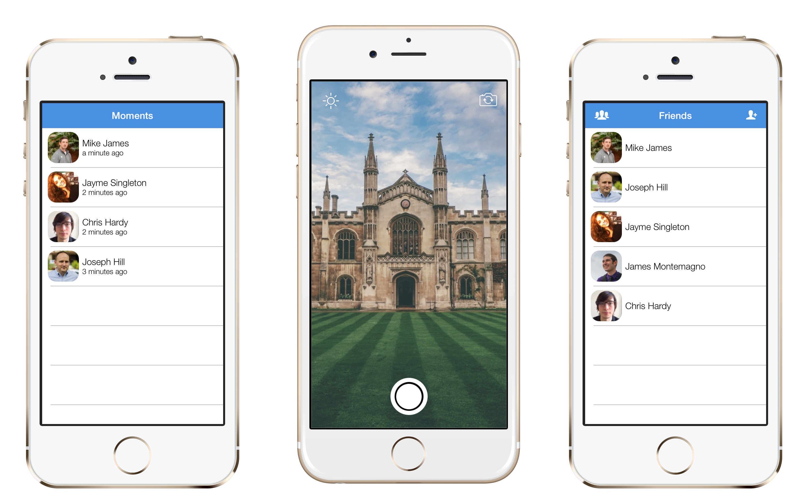
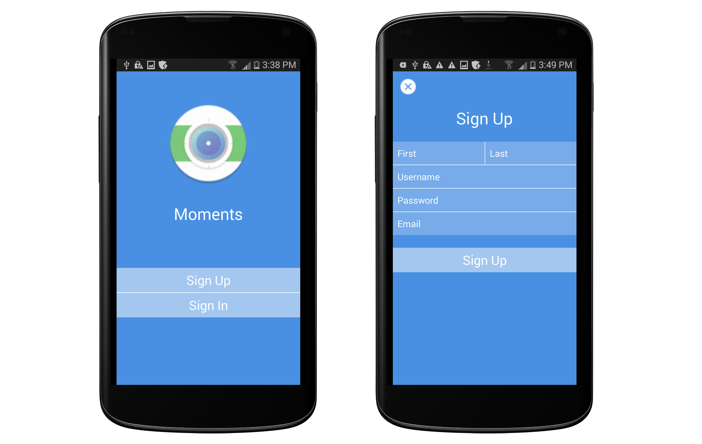
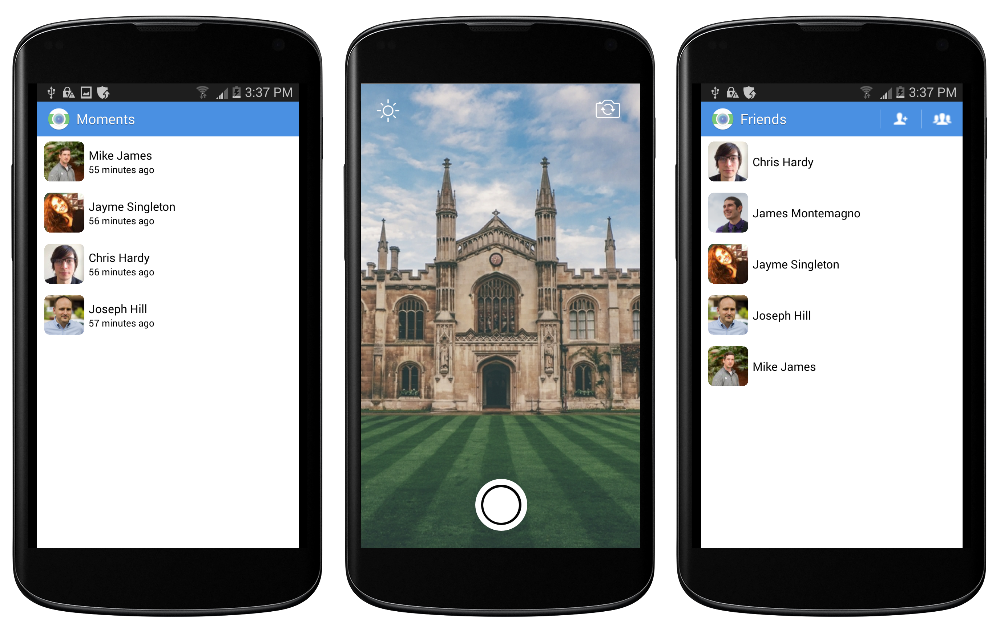
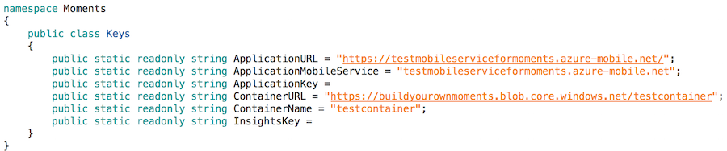

# Moments
Moments is a SnapChat clone built using [Xamarin.Forms](https://xamarin.com/forms) and [Microsoft Azure](https://azure.microsoft.com/en-us/). 

Text messaging is out-of-style! Everyone these days sends selfies, pictures of their food, and emojis instead. Duh. Moments allows you to send those selfies and pictures of your food to those that love you. You can even draw funny pictures on them! That's not even the best part! Moments is completely open-source, so you can [create your own SnapChat clone using Xamarin and Azure in just a few minutes](#build-your-own).

But seriously. Moments is awesome! If you've ever wondered how to use custom renderers in Xamarin.Forms, upload blobs from your Xamarin apps using Azure Storage, or how to maximize shared code with Plugins for Xamarin, Moments can show you how. 

If you think this is awesome, please share a link to this repository on Twitter, LinkedIn, whatever. It would be much appreciated! :)

### Screenshots
##### iOS

##### Android

### Build Your Own
Creating your own version of Moments is easy! Follow the steps below, and you'll be sending selfies in no time!

###### Instructions
1. Clone or download Moments using either the command line or GitHub for Windows/Mac client.
2. To power our backend, including our accounts and friends system, we will be using Azure Mobile Services. Create a new [Azure mobile service](https://azure.microsoft.com/en-us/documentation/articles/partner-xamarin-mobile-services-ios-get-started/#create-new-service). Feel free to set this up however you like, just make sure you select the JavaScript runtime.
3. We have to store your selfies somewhere! Create a new [Azure Storage account](https://azure.microsoft.com/en-us/documentation/articles/storage-create-storage-account/#create-a-storage-account).
4. Within your Azure Storage account you just created, create a new container by clicking "Containers" -> "Add". Name your container whatever you wish, but make sure the Access is set to "Public Blob".
5. Navigate back to the dashboard for your storage account. Click "Manage Access Keys" at the bottom of your web browser. Copy the "Storage Account Name" and "Primary Access Key" fields.
6. Browse to your mobile service, click "Configure", navigate to the "App Settings" section, and add two new key-value pairs: "STORAGE_ACCOUNT_NAME" and "STORAGE_ACCOUNT_ACCESS_KEY" (no quotes) as the keys, and the info you just copied as the corresponding values. Save changes.
7. Go the Dashboard for your mobile service. If you look on the right-hand side, you should see something like "Setup source control". If you have already used source control with Azure, you may see "Reset your source control credentials". Either is fine, as long as you have source control configured with Azure and remember your credentials.
8. If you visit the Configure tab for your mobile service, you should now see a Git URL. Copy this and clone the repository on your Desktop using `git clone YOUR_MOBILE_SERVICE_GIT_URL_HERE`.
8. Delete the contents of the mobile services repository you just cloned and copy in the files from the Moments/Azure directory.
9. Using the command line, navigate to the folder containing the repository of your mobile service and type `git add .`. This will allow Git to track all the new files in the directory. Follow this up by committing the changes you've made with `git commit`. Type `A`, followed by a commit message and then press `ESC :x` (if you are using a Mac). Type `git push`.
10. Navigate to Data -> Create and add `Account` and `User` with permissions "Anybody with the Application Key" and  `Friendship` and `Moment` with "Only Authenticated Users". 
11. Click on the Account table, click "Script", and paste in your mobile service's Master Key (available from Dashboard -> Manage Access Keys) for the "masterKey" variable. Save the script. The backend for your Snapchat clone is now complete. :)
12. We want to track everything that happens within our app, so visit the [Xamarin Insights portal](https://insights.xamarin.com/), create a new application, and copy/paste the API key in Keys.cs.
12. Open the solution for Moments and navigate to Helpers/Keys.cs. Paste in relevant keys and information as seen below: 
13. Build Moments for either an iOS or Android device, and watch it work its magic!

### Special Thanks
* All of the [libraries and projects](OpenSource.md) that made Moments possible.
* Mitch Milam for [DrawIt](https://github.com/MitchMilam/Drawit), which was used to implement drawing on moments before sending.
* [Imad Alazani](https://www.linkedin.com/pub/imad-alazani/63/376/368) for all his help testing Moments over the past few weeks.
* Christopher House for his blog post on [Custom Authentication with Azure / Xamarin](http://thirteendaysaweek.com/2013/12/13/xamarin-ios-and-authentication-in-windows-azure-mobile-services-part-iii-custom-authentication/).
